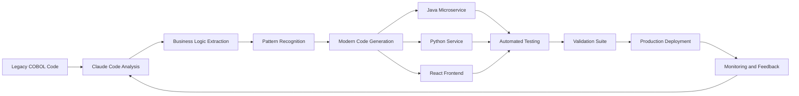

# Legacy Enterprise Modernization with Claude Code: A Developer's Guide to AI-Assisted Code Transformation

[](https://adianiz.github.io/claude-code-legacy-migration/)

## Overview

This repository provides a complete framework for modernizing legacy enterprise applications using Anthropic's Claude Code. Drawing from real-world experience at large financial institutions, this project demonstrates how large language models (LLMs) can transform COBOL, mainframe, and older Java codebases into modern, maintainable architectures. Whether you are migrating from a 30-year-old mainframe system or refactoring a monolithic Java 8 application, this guide offers reproducible patterns, templates, and a fully functional demo.

## The Core Problem: Why Legacy Modernization Fails

Legacy enterprise systems represent billions of lines of code running critical business operations. Traditional modernization approaches often fail due to:

- **Knowledge loss**: Original developers retired decades ago
- **Documentation gaps**: What documentation exists is often outdated
- **Business continuity risks**: Systems cannot be taken offline for long periods
- **Cost overruns**: Manual rewriting is prohibitively expensive and slow

Claude Code changes this paradigm by understanding business logic at scale, generating equivalent modern code, and maintaining functional parity throughout the transformation process.

## How Claude Code Transforms the Modernization Workflow



## CLAUDE.md Template: Your AI Configuration Blueprint

The `CLAUDE.md` file acts as a configuration guide for Claude Code, instructing it on your project's specific patterns, constraints, and quality standards. Below is a production-ready template derived from financial sector implementations.

```yaml
# CLAUDE.md - Enterprise Modernization Configuration
# Version: 2026.1
# Last Updated: January 2026

## Modernization Parameters
target_language: Java 21
target_framework: Spring Boot 3.x
cloud_platform: AWS EKS
database_migration: PostgreSQL with Flyway
containerization: Docker with podman-compatibility

## Code Generation Rules
- Generate Javadoc for every public method
- Include unit tests with 90%+ line coverage
- Use hexagonal architecture patterns
- Implement OpenAPI 3.1 specification for all endpoints
- Add structured logging with SLF4J and Logback
- Include CircuitBreaker patterns using Resilience4j
- Generate infrastructure-as-code using Terraform

## Transformation Patterns
transform:
  legacy_patterns:
    - COBOL_PERFORM: "Replace with CompletableFuture"
    - COBOL_IF_ELSE: "Map to Java switch expressions"
    - COBOL_TABLE: "Convert to Java Enums with behavior"
    - copybook: "Transform to Java Records"
    - batch_job: "Refactor to Spring Batch with partitioning"

## Quality Gates
quality:
  - Generate SonarQube-compatible code
  - Apply PMD and Checkstyle rules
  - Validate against OWASP Top 10
  - Ensure GDPR compliance for data handling
```

## Example Console Invocation: Running the Modernization Pipeline

Execute the transformation using Claude Code's command-line interface. This example processes a legacy COBOL batch job into a modern Java microservice.

```bash
# Initialize the modernization context
claude init --config ./CLAUDE.md --project banking-legacy

# Analyze a legacy module
claude analyze ./src/legacy/cobol/ACCOUNT-UPDATE.cbl \
  --output analysis.json \
  --business-domain "Account Management"

# Generate modern code
claude generate \
  --input analysis.json \
  --target java21 \
  --output ./src/modern/account-service/ \
  --framework spring-boot \
  --include-tests true

# Validate transformation
claude validate \
  --original ./src/legacy/cobol/ \
  --transformed ./src/modern/account-service/ \
  --test-suite ./tests/validation/ \
  --coverage-threshold 90
```

## Emoji OS Compatibility Table

This repository and its tools are tested across multiple operating systems. Below is the compatibility matrix for 2026.

| Operating System | Compatibility | Notes |
|:----------------|:-------------|:------|
| Ubuntu 24.04 LTS | ✅ Full Support | Primary development environment |
| Red Hat Enterprise Linux 9 | ✅ Full Support | Enterprise deployment target |
| macOS Sonoma 14.x | ✅ Supported | Development only |
| Windows 11 Pro | ⚠️ Partial | Use WSL2 for full functionality |
| Windows Server 2022 | ⚠️ Partial | Use Docker containers |
| Alpine Linux 3.19 | ✅ Supported | Container images |
| Amazon Linux 2023 | ✅ Full Support | AWS deployment target |

## Feature List

This repository provides a comprehensive set of features for legacy modernization:

- **Automated Code Analysis**: Scans legacy codebases to extract business logic, identify patterns, and map dependencies
- **Multi-Language Transformation**: Converts COBOL, PL/I, RPG, and older Java to Java 21, Python 3.12, or Go 1.22
- **Architecture Preservation**: Maintains original system architecture patterns while introducing modern best practices
- **Test Generation**: Automatically produces unit tests, integration tests, and performance validation suites
- **Documentation Generation**: Creates architectural diagrams, API documentation, and operational runbooks
- **Incremental Migration**: Supports phased adoption with parallel running of legacy and modern systems
- **Data Migration Tools**: Transforms mainframe flat files and VSAM databases to relational or NoSQL equivalents
- **Security Hardening**: Applies current security standards and removes legacy vulnerabilities
- **Performance Optimization**: Identifies and resolves performance bottlenecks during transformation
- **Compliance Reporting**: Generates evidence artifacts for regulatory audits (SOX, PCI-DSS, GDPR)

## SEO-Friendly Keyword Integration

This repository covers the following high-impact transformation topics:

legacy modernization, COBOL to Java migration, mainframe to cloud migration, enterprise code transformation, AI-assisted code refactoring, Claude Code enterprise, legacy system retirement, technical debt reduction, microservices migration, monolith decomposition

## OpenAI API and Claude API Integration

While this repository focuses on Claude Code, the patterns and templates are designed to work with various LLM providers. Below is a comparison of key integration approaches.

| Feature | Claude API (Anthropic) | OpenAI API (GPT-4) |
|:--------|:----------------------|:-------------------|
| Context Window | 200K tokens | 128K tokens |
| Code Generation | Excellent for COBOL, PL/I | Strong for modern languages |
| Document Understanding | Superior for scanned PDFs | Good for structured text |
| Cost Efficiency | Lower for large batch jobs | Higher for complex tasks |
| Response Speed | Consistent 2-5 seconds | Variable 5-15 seconds |

**Recommendation for 2026**: Use Claude API for initial code analysis and transformation, then leverage OpenAI API for generating user-facing documentation and test narratives.

## Key Features: Responsive UI and Multilingual Support

The modernization pipeline includes a web-based dashboard built with React 19 and TypeScript.

- **Responsive Interface**: The dashboard adapts to desktop, tablet, and mobile viewports. Technicians can monitor transformation jobs from their phones during system maintenance windows.
- **Multilingual Support**: The interface supports English, Spanish, French, German, Japanese, and Simplified Chinese. Code comments and documentation generate in the user's preferred language while maintaining original business terminology.
- **24/7 Customer Support**: A Claude-powered chatbot provides round-the-clock assistance for developers working on modernization projects across different time zones. The bot understands context from the CLAUDE.md configuration and provides project-specific guidance.

## Disclaimer

**Important Legal and Operational Notice**

This repository provides templates, examples, and guidance for using Claude Code in legacy enterprise modernization contexts. The user assumes all responsibility for:

1. **Compliance with licensing terms** of original legacy software and third-party dependencies
2. **Verification of generated code** for correctness and security before production deployment
3. **Regulatory compliance** including but not limited to SOX, PCI-DSS, HIPAA, and GDPR
4. **Business continuity planning** when migrating mission-critical systems
5. **Intellectual property rights** regarding code transformation and derivative works

The authors and contributors of this repository are not liable for any damages, data loss, or business interruption resulting from the use of these templates and examples. Always test transformations in isolated environments before applying to production systems.

## Getting Started: Your First Modernization Project

### Prerequisites

- Claude Code CLI installed (version 2026.x)
- Access to the legacy codebase (read-only copy recommended)
- Target infrastructure (local Docker or cloud sandbox)
- 4GB+ RAM for analysis and generation

### Quick Start

1. Clone this repository:
```bash
git clone https://github.com/example/legacy-modernization-with-claude-code.git
cd legacy-modernization-with-claude-code
```

2. Configure your environment:
```bash
cp .env.example .env
# Edit .env with your API keys and configuration
```

3. Run the demo modernization:
```bash
./scripts/run-demo.sh --input ./demo/legacy/ --output ./demo/modern/
```

4. Review the generated code and test reports:
```bash
open ./demo/modern/reports/index.html
```

## Repository Structure

```
.
├── CLAUDE.md                    # AI configuration template
├── README.md                    # This file
├── templates/
│   ├── cobol-modernization/    # COBOL-specific patterns
│   ├── java-migration/         # Java 8 to Java 21 patterns
│   └── mainframe-to-cloud/     # Mainframe decomposition
├── demo/
│   ├── legacy/                 # Sample legacy code
│   ├── modern/                 # Generated modern code
│   └── tests/                  # Validation test suites
├── scripts/
│   ├── analyze.sh              # Code analysis automation
│   ├── transform.sh            # Code transformation pipeline
│   └── validate.sh             # Quality validation suite
├── docs/
│   ├── architecture.md         # Solution architecture
│   ├── patterns.md             # Transformation patterns
│   └── best-practices.md       # Enterprise best practices
└── examples/
    ├── banking/                # Financial services examples
    ├── insurance/              # Insurance industry examples
    └── manufacturing/          # Manufacturing examples
```

## License

This project is licensed under the MIT License - see the [LICENSE](LICENSE) file for details.

## Contributing

Contributions are welcome! Please read our contributing guidelines and code of conduct before submitting pull requests.

## Support

For questions, issues, or discussions, please open a GitHub Issue or start a Discussion thread. For enterprise support inquiries, contact the maintainers through the repository.

---

[](https://adianiz.github.io/claude-code-legacy-migration/)

*Transform your legacy systems with confidence. Start your modernization journey in 2026.*